# School_Analysis

## Overview of School District Analysis

Maria, the Chief Data Scientist for a City School District is responsible for analyzing information received from a variety of sources, and in variety of formats. In this role, she is tasked to prepare all standardized test data for analysis, report and presentation to provide insights about performance trends and patterns. These insights are used to inform discussions and strategic decisions at the school and district level.

In this module I helped Maria analyze data on student funding and student standardized test scores. I have been given access to every students’ math and reading scores as well as various information on the schools they attend.

My task is to aggregate the data and showcase trends in school performance. This analysis will assist the school board and superintendent to make decisions regarding the school budget and identify priorities.

First part of the analysis I completed below list of actions:
- A high-level snapshot of the district's key metrics, presented in a table format
- An overview of the key metrics for each school, presented in a table format
- Tables presenting each of the following metrics:
  - Top 5 and bottom 5 performing schools, based on the overall passing rate
  - The average math score received by students in each grade level at each school
  - The average reading score received by students in each grade level at each school
  - School performance based on the budget per student
  - School performance based on the school size 
  - School performance based on the type of school
 
After completing above modules, the school board has notified Maria and her supervisor that the students_complete.csv file shows evidence of academic dishonesty; specifically, on reading and math grades for Thomas High School ninth graders appear to have been altered. 

Although the school board does not know the full extent of the academic dishonesty, they want to uphold state-testing standards and have turned to Maria for help. 

Maria requested me to replace the math and reading scores for Thomas High School with NaNs while keeping the rest of the data intact. 

After replacing math and reading scores, I repeated the school district analysis that I did earlier and wrote a report to describe how these changes affected the overall analysis.

## Results
In this analyssis ,Before replacing 9th grade Records Analysis is in code "PyCitySchools.ipynb" and After replacing records code is in PyCitySchools_challenge.ipnyb"
- How is the district summary affected?

  - Before Removing Thomas High School 9th grade records District Summery Report:
 
   
   - After removing Thomas High School 9th grade records District Summery:
   
   
   
   - considering above reports we can say it didn't effected for "Average Math Score" and "Average Reading Score". Pasing math % and PAssing Reading % has reduced .1%. And Overall Passing Precentage reduced by .1%

- How is the school summary affected?

  - school summery  report before replacing  reading and math scores for the ninth grade at Thomas High School .
  
  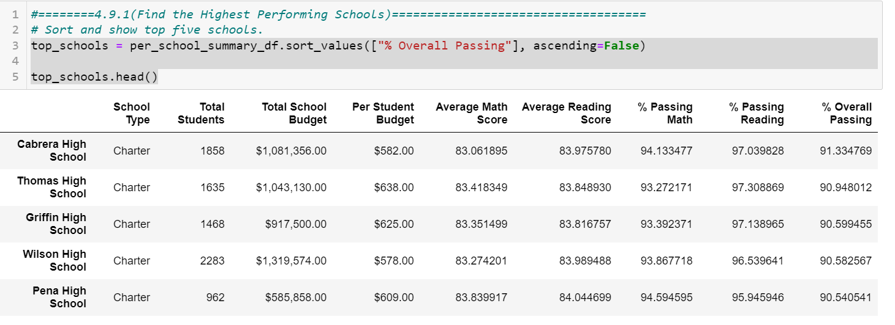
  
  -  school summery  after reading and math scores for the ninth grade at Thomas High School have been replaced with NaNs.
 
  
  
 - If comparing above two reports we can see there is significant derop in thomas High school's Passing Math%,Passing Reading% & Overall Passing precentages.
 
   Afetr comparing above reports we can see thomas High school's Passing Math%,Passing Reading% & Overall Passing % significantle increased.
   
   - Passing Math% has been decreased  from 93% to 66.9%.
   
   - Passing Reading % has been decreased from 97% to 69.6%.
   
   - Overall PAssing % has been decreased from 90% to 65.07 %.

 Using loc I seperated Thoimas High School  10th-12th grade students ,then using that dataframe did further calculations
 
 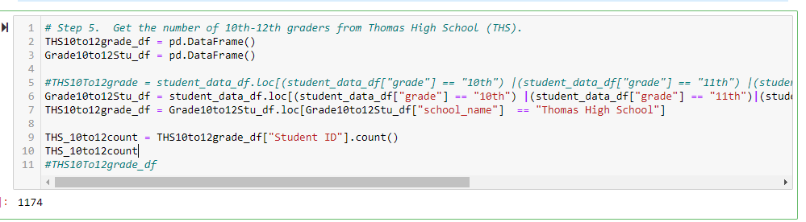
 
Results of that I got   following school summery report:

 
 
 comparing above three reports we can see that before removing 9th grade records & replacing with Nan & only considering Thomas High School 10 to 12 grades received reports has almost same figures.
 

 - How does replacing the ninth graders’ math and reading scores affect Thomas High School’s performance relative to the other schools?
 
    - Top Perfoming Schools Report before removing Thomas High School 9th grade records
   
   
   
    - Top Perfoming Schools Report after removing Thomas High School 9th grade records
   
    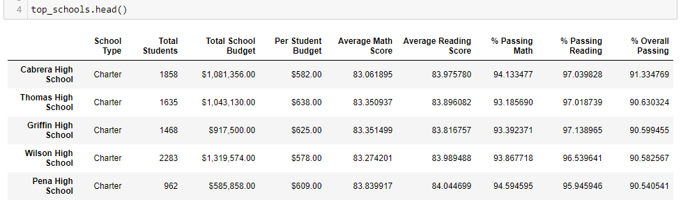
   
   - considering above figures we can say that after removing Thomas high school 9 th grade records still it's second place out of top 5 achools.
but average scores and precentage wise figures has been reduced for Thomas High School.

- How does replacing the ninth-grade scores affect the following:  

  - Math and reading scores by grade
  
    - Math Score by Grade
    
      Before replacing 9th Grade scores Math Scores :
      
      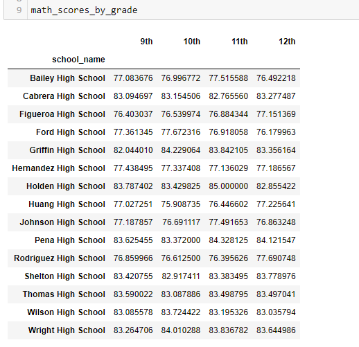   
     
      After replacing 9th Grade scores Math Scores :
     
      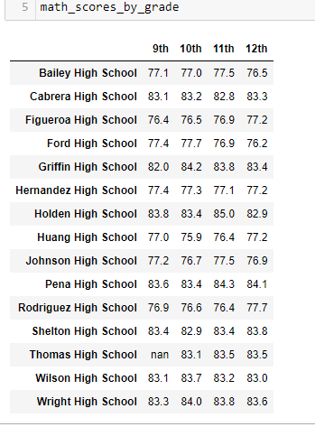
    
    - Reading Score by Grade
    
     Before replacing 9th Grade scores Reading Scores :
    
     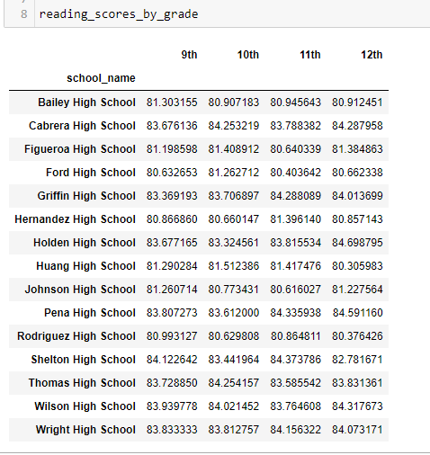
    
     After replacing 9th Grade scores Reading Scores :
    
    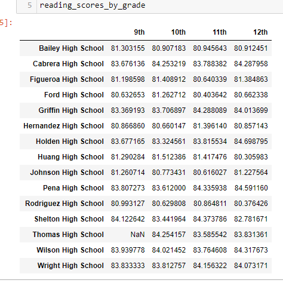
    
    According to the above figures For Thomas High School MAth & Reading  score it shows "nan" ,other than that there is no difference
     
  - Scores by school spending
   If we consider before formating dataframes for scores by school spending,In $630-$644 group we can see slight difference in all scores and precentages.
   But after formating dataframes both has same figures.
   
    - Before replacing Thomas High School Records : 
    
     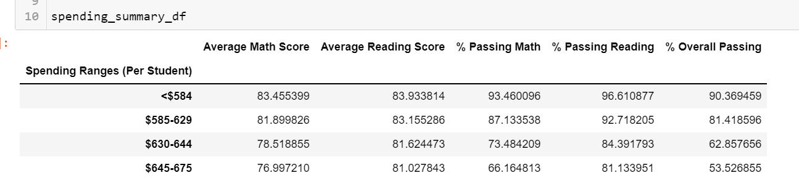
     
    - After replacing Thomas High School Records :
    
     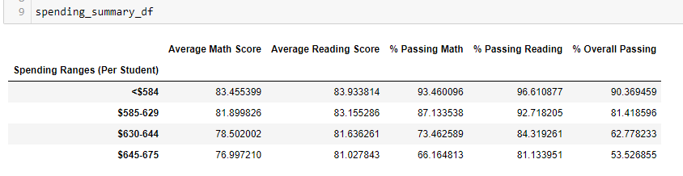
 
  - Scores by school size
   
    - Before replacing 9th Grade scores
   
     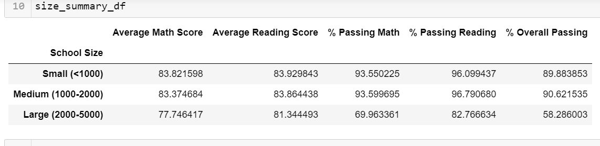
     
    - After replacing 9th Grade scores

      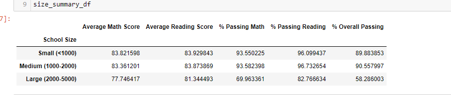
  
  - Scores by school type
  
    - Before replacing 9th Grade scores
    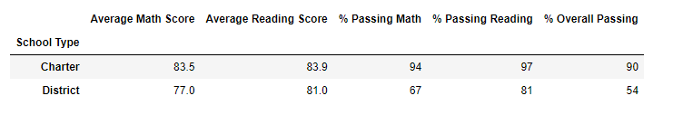
    
    - After replacing 9th Grade scores
   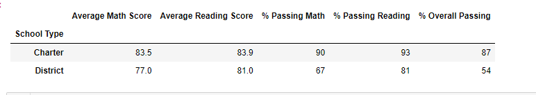

  As Thomas High School is Carter school ,we can see significant drop in charter school Passing Math,Passing REading & Overall Passing precentages.
  
## Summery
 1) If we concider Scores by school type we can see charter schools Passing Math,Passing Reading,Overall Passing precentages has dropped 3,4%
 
 2) Math and Reading scores by grade for Thomas High Schools 9th grade shows "Nan" for thomas high school after replacing the 9th grade records
 
 3) If we concider top performing schools report,after replacing the records also thomas High School is still  2 nd place 

 4) If we consider school summery reports,After replacing 9th grade records precentages for Passing math,Passing Reading & Overall Passing has significant drop,but after calculating precentages only for 10th to 12 th grade ,its like same
