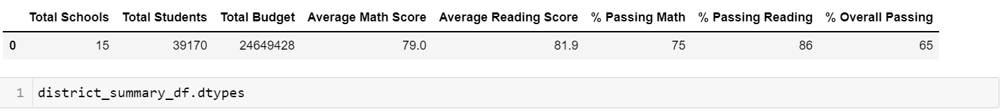
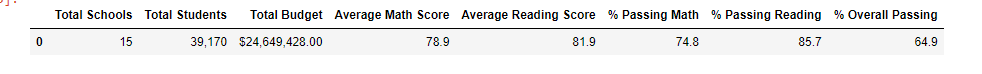
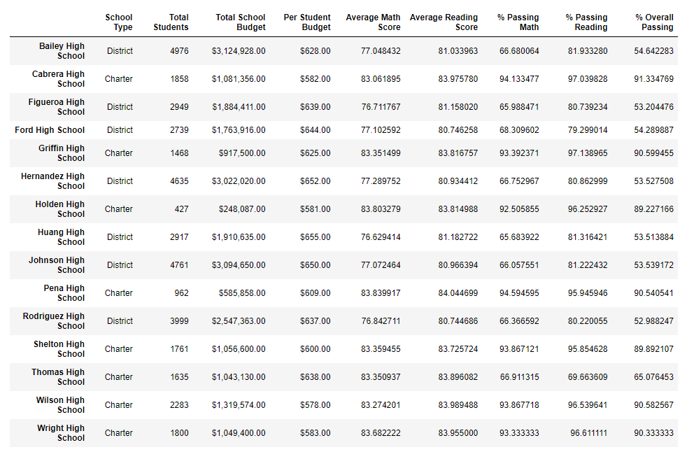
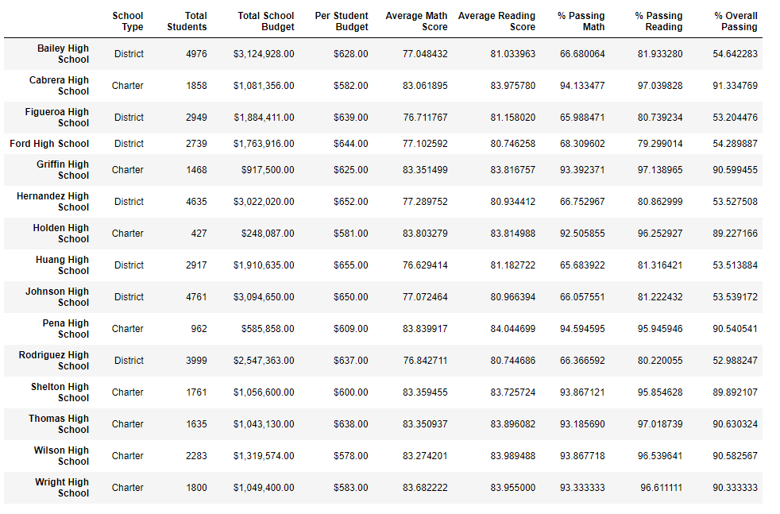

# School_Analysis

## Overview of School District Analysis

Maria, the Chief Data Scientist for a City School District is responsible for analyzing information received from a variety of sources, and in variety of formats. In this role, she is tasked to prepare all standardized test data for analysis, report and presentation to provide insights about performance trends and patterns. These insights are used to inform discussions and strategic decisions at the school and district level.

In this module I helped Maria analyze data on student funding and student standardized test scores. I have been given access to every students’ math and reading scores as well as various information on the schools they attend.

My task is to aggregate the data and showcase trends in school performance. This analysis will assist the school board and superintendent to make decisions regarding the school budget and identify priorities.

First part of the analysis I completed below list of actions:
- A high-level snapshot of the district's key metrics, presented in a table format
- An overview of the key metrics for each school, presented in a table format
- Tables presenting each of the following metrics:
  - Top 5 and bottom 5 performing schools, based on the overall passing rate
  - The average math score received by students in each grade level at each school
  - The average reading score received by students in each grade level at each school
  - School performance based on the budget per student
  - School performance based on the school size 
  - School performance based on the type of school
 
After completing above modules, the school board has notified Maria and her supervisor that the students_complete.csv file shows evidence of academic dishonesty; specifically, on reading and math grades for Thomas High School ninth graders appear to have been altered. 

Although the school board does not know the full extent of the academic dishonesty, they want to uphold state-testing standards and have turned to Maria for help. 

Maria requested me to replace the math and reading scores for Thomas High School with NaNs while keeping the rest of the data intact. 

After replacing math and reading scores, I repeated the school district analysis that I did earlier and wrote a report to describe how these changes affected the overall analysis.

## Results

- How is the district summary affected?

  - Before Removing Thomas High School 9th grade records District Summery Report:
 
   
   - After removing Thomas High School 9th grade records District Summery:
   
   
   
   - considering above reports we can say it didn't effected for "Average Math Score" and "Average Reading Score". Pasing math % and PAssing Reading % has reduced .1%. And Overall Passing Precentage reduced by .1%

- How is the school summary affected?

  - School Summery Report before removing Thomas High School 9th grade records
 
  
   
 - School Summery Report after removing Thomas High School 9th grade records
 
   
   Afetr comparing above reports we can see thomas High school's Passing Math%,Passing Reading% & Overall Passing % significantle increased.
   
   - Passing Math% has been increased from 66.9% to 93%
   
   - Passing Reading % has been increased from 69.6% to 97%
   
   - Overall PAssing % has been increased from 65.07 % to 90%
